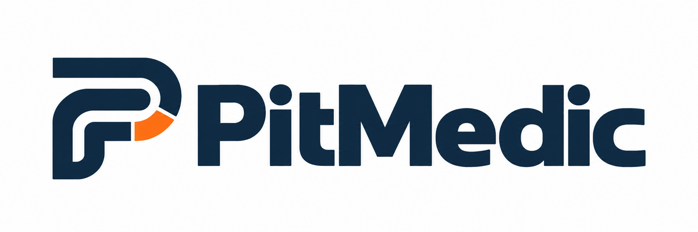

# PitMedic

PitMedic is a free, ad-free, open-source Windows simulator reliability monitor and repair assistant. It watches supported racing simulators, captures useful evidence when something goes wrong, explains the finding in plain language, and offers safe, reversible repairs when a known automatic fix is available.

<!-- current-release:start -->
Current signed release: **1.0.0.1**

- [Download the v1.0.0.1 signed Windows installer](https://github.com/rholmes426/PitMedic/releases/download/v1.0.0.1/PitMedic-Setup-x64.exe)
- [View the v1.0.0.1 release and checksums](https://github.com/rholmes426/PitMedic/releases/tag/v1.0.0.1)

The installer, PitMedic app, repair helper, and sensor service are signed and timestamped.
<!-- current-release:end -->

## Supported simulators

- Le Mans Ultimate
- iRacing
- Assetto Corsa EVO
- RaceRoom Racing Experience
- Assetto Corsa Competizione
- Automobilista 2

## Release highlights

- CPU monitoring setup detects missing sensor prerequisites and explains unavailable readings.
- iRacing installation status checks no longer create failed-launch findings; saved findings based solely on that probe lose their obsolete repair recommendation.
- The Diagnostic Library explains the evidence and available repairs for supported simulators and companion software.

See the current release above for its changes and verification details, or browse the [release history](https://github.com/rholmes426/PitMedic/releases).

## Build on Windows

Install the .NET 10 SDK, clone the repository, and run `Build and Run PitMedic.cmd`. The development builder creates an unsigned, self-contained Windows x64 build in `Output` and starts it.

Local development builds are not release artifacts. Public signed releases must pass the repository's Azure Artifact Signing workflow and signature verification.

The release workflow produces `PitMedic-Setup-x64.exe` plus a portable ZIP. PitMedic itself runs without administrator rights. The installer registers a narrowly scoped, read-only CPU sensor service during its one setup approval so normal app launches do not need administrator approval. Protected repairs use the separate, one-shot `PitMedic.RepairHelper.exe` only when a protected change is selected.

## Support PitMedic

PitMedic stays free and every feature is available without contributing. If it has been useful and you would like to help with hosting, signing, and development costs, you can make a voluntary contribution through [PayPal](https://paypal.me/PitMedicApp). Contributions do not unlock features or preferential support.

## Project commitments

- Every feature remains free; voluntary contributions unlock nothing.
- No advertising, affiliate repair recommendations, license keys, or paid tiers.
- Diagnostics always remain local. Optional anonymous usage counting is off by default, previews its complete six-field payload, and never includes diagnostics or a permanent identifier.
- Automatic repairs follow the backup, duration, approval, and recovery rules documented in `Source/PROJECT_POLICY.md` and `Source/REPAIR_AUTOMATION_MATRIX.md`.
- Simulator names are compatibility references; PitMedic is not affiliated with or endorsed by simulator publishers or Valve.

## Open source and security

PitMedic is licensed under [GPL-3.0-or-later](LICENSE). See [CONTRIBUTING.md](CONTRIBUTING.md), [SECURITY.md](SECURITY.md), the [privacy statement](Source/PRIVACY.md), and the [code signing policy](CODE_SIGNING_POLICY.md).

Public-trust code signing is provided through Microsoft Azure Artifact Signing. Signed releases are built from an immutable public tag, authenticated to Azure through GitHub OIDC, timestamped, verified, and accompanied by SHA-256 information. The app and both scoped helpers are signed before the installer is built; the completed installer is then signed and verified separately.
